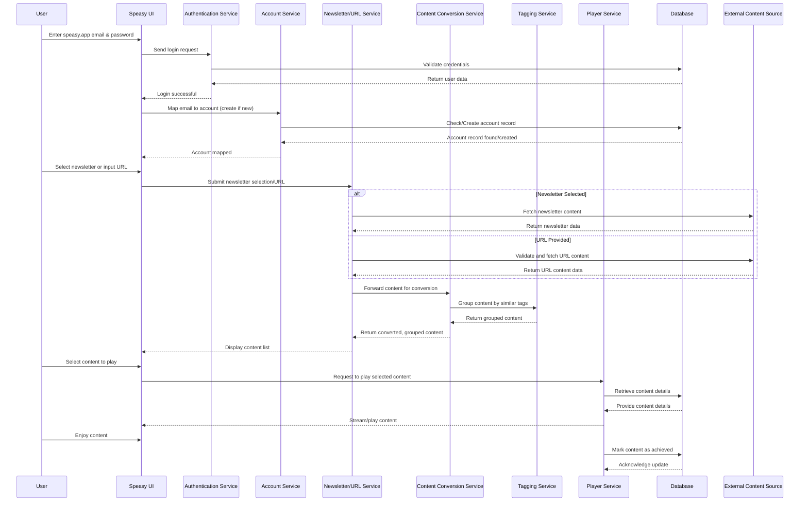

### Explanation of the Flow

1. **Login and Account Mapping**  
   - **User Login:** The user enters their speasy.app email address and password on the Speasy UI.  
   - **Authentication:** The UI sends a login request to the Authentication Service. This service validates the credentials (with a lookup in the database) and returns a successful login result.  
   - **Account Mapping:** Once logged in, the UI requests the Account Service to map the speasy.app email to an account. If the account doesn’t exist, the service creates one by interacting with the database.

2. **Content Request (Newsletter Selection or URL Submission)**  
   - **User Choice:** The user then either selects a newsletter from a list or submits a URL directly via the Speasy UI.  
   - **Content Retrieval:** The UI forwards this request to a Newsletter/URL Service.  
   - **Fetching Content:**  
     - If a newsletter is selected, the service fetches the newsletter content from an external source.  
     - If a URL is submitted, the service first validates the URL and then retrieves the associated content.
   - **Conversion and Grouping:** The raw content is sent to the Content Conversion Service, which converts it into a standardized format. To enhance usability, this service calls on a Tagging Service to group the converted content by similar tags.
   - **Displaying Content:** The grouped, converted content is returned back through the services and finally displayed by the Speasy UI.

3. **Playing and Achieving Content**  
   - **Content Playback:** The user selects one piece of content to play. The UI sends a play request to the Player Service, which retrieves the content details (possibly from the database) and streams the content.  
   - **Marking as Achieved:** After the content is played, the Player Service marks it as “achieved” (or completed) in the database so that the user’s progress is tracked.

---

### Mermaid Sequence Diagram

---

### Summary

- **Login Phase:** The diagram shows how Speasy handles authentication and account mapping using the speasy.app email.
- **Content Retrieval and Processing:** It illustrates two parallel paths where a user can either pick a newsletter or add a URL. The content is then converted, grouped by tags, and delivered to the UI.
- **Playback and Completion:** Finally, when a user plays the content, the Player Service retrieves and streams it, and afterward marks it as achieved.
